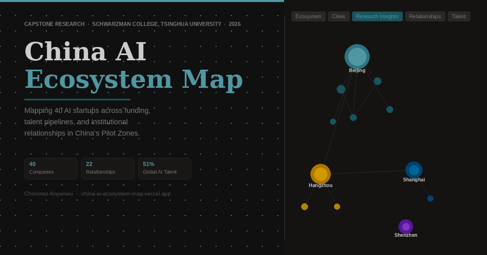

# China AI Ecosystem Map

**Thesis Research · Interactive Portfolio Artifact**  
Chinonso Anyanwu · Schwarzman College, Tsinghua University · 2026

[**Live Site →**](https://china-ai-ecosystem-map.vercel.app)

---

---

## What This Is

An interactive, single-page research tool mapping China's top 40 AI startups against the analytical framework of this thesis: *developmental orchestration* — the mechanism by which China's AI Pilot Zones coordinate capital, institutional resources, and talent to produce frontier AI ecosystems.

Built as a portfolio artifact for investors, researchers, and institutional audiences. Every data point is sourced; every relationship is verified.

---

## Core Argument

> China's AI Pilot Zones represent a new form of digital-era state capacity — exercised not through direct ownership, but through *developmental orchestration*: coordinating capital allocation, governing data and compute infrastructure, and integrating universities, startups, and government agencies into shared innovation platforms.

This extends Justin Yifu Lin's New Structural Economics to the digital economy, with Beijing's AI Pilot Zone as the primary case and Hangzhou as a secondary reference point.

---

## Tabs

| Tab | What It Shows |
|---|---|
| **Ecosystem Table** | 40 companies, filterable by sector. City, funding level, policy alignment, thesis relevance score (1–5). |
| **City Breakdown** | AI Pilot Zone concentration: Beijing (19), Hangzhou (8), Shanghai (6), Shenzhen (5). |
| **Research Insights** | Six analytical cards across the three orchestration domains. Key Takeaways at top. |
| **Relationships** | 22 verified linkages: Funding, University Spinouts, Research Labs, Platform Dependencies. Each sourced. |
| **Talent** | Institutional pipeline map. Origin to company. Filtered by institution type. |

---

## Key Findings

- **51%** of the world's top AI researchers originate from Chinese undergraduate institutions (up from 29% in 2019)
- **Beijing dominates** through institutional density: Tsinghua spinouts, BAAI, state guidance funds, and the AI Pilot Zone converge in a single bounded policy environment
- **Universities are the primary formation mechanism**: direct spinouts (Zhipu AI, Vidu, SoundAI) and founder pipelines (DeepSeek/ZJU, MiniMax/CAS) account for the majority of top-10 companies
- **Two orchestration models**: Beijing's state-academic integration vs. Hangzhou's platform-anchored coordination under Alibaba
- **Compute sovereignty** is a binding constraint: US export controls have made Cambricon, Moore Threads, and Huawei Ascend strategic infrastructure assets

---

## Data Standards

This tool was built from first principles alongside the thesis. Each company was individually researched — no third-party AI startup lists were used as a primary source.

**Relationship inclusion threshold:**
- Primary: IPO prospectus, public filing, official institutional statement
- Tier-1 secondary: Bloomberg, Reuters, SCMP, Nature, Forbes, The Economist
- Each relationship card links directly to its source. Widely cited but unverifiable claims are excluded, not approximated.

**Macro data:**
- MacroPolo Global AI Talent Tracker 2.0 (2024) + The Economist NeurIPS 2025 analysis (March 2026)
- Stanford AI Index 2024
- Bloomberg/LexisNexis patent data (Fortune, Nov 2025)
- aiworld.eu investment data (2025)

---

## Theoretical Grounding

| Framework | Application |
|---|---|
| New Structural Economics (Lin) | Extended to digital economy; AI Pilot Zones as latecomer upgrading mechanism |
| Developmental State Theory (Chang, Naughton) | State as coordinator, not just owner |
| Entrepreneurial State (Mazzucato) | State as risk-absorber and market-maker in AI |
| AI Governance in China (Ding, DigiChina) | Diffusion constraints and regulatory architecture |

---

## Citation

> Anyanwu, C. (2026). *China's AI Pilot Zones and Developmental Orchestration: Public-Private Partnerships, Capital Coordination, and Institutional Integration in the Digital Economy.* Schwarzman College, Tsinghua University.

---

*Single-file SPA — no build step, no dependencies. All data as of Q1 2026. v1.0 · April 2026*
